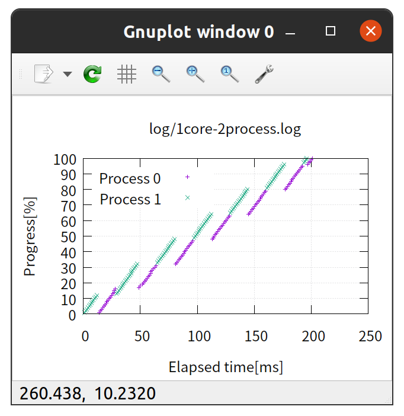
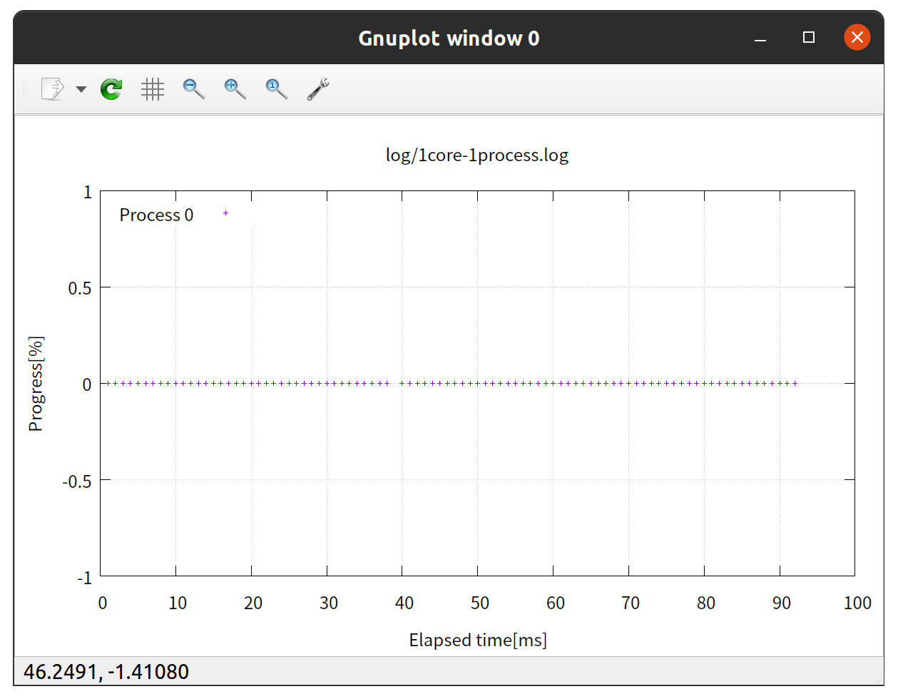
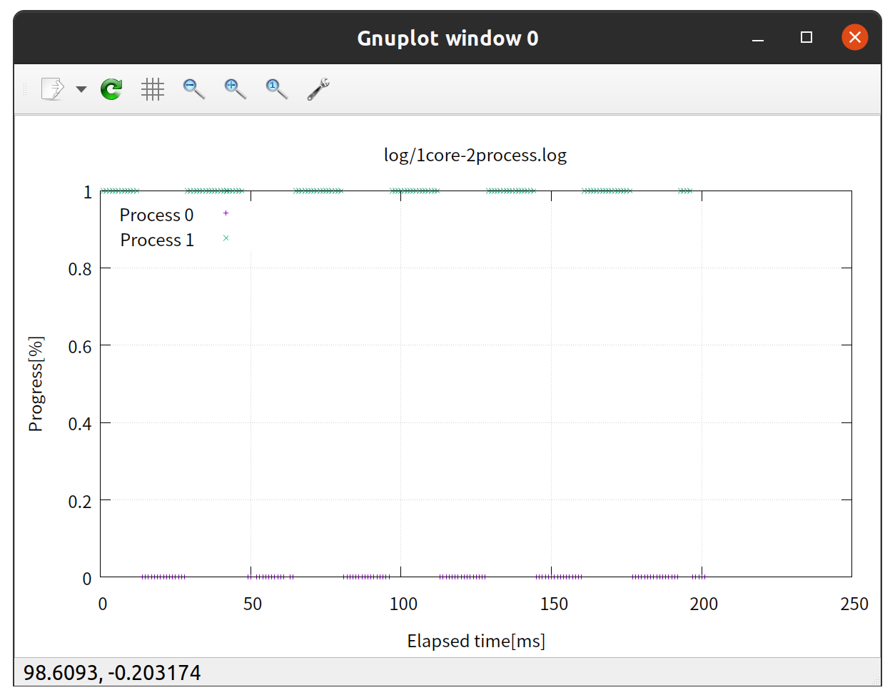

# Chapter 4. 프로세스 스케줄러

- 프로세스 스케줄러는 여러 프로세스를 타임 슬라이스 방식으로 번갈아 처리한다.

  - CPU는 한번에 하나의 프로세스만 처리할 수 있다.

- 시스템에서 CPU로 인식하는 것을 논리 CPU라고 하며, 하이퍼스레딩이 적용된 경우 각 하이퍼스레드가 논리 CPU로 인식된다.

---

## 테스트 프로그램으로 작동 방식 확인하기

- 알고자 하는 정보

  - 논리 CPU가 특정 시점에 어떤 프로세스를 실행 중인가

  - 각 프로세스의 진행률

- 테스트 프로그램 사양

  - 명령어 라인 파라미터(nproc, total, resolution)

    |파라미터|설명|
    |:-:|:-:|
    |nproc|동시 동작 프로세스 수|
    |total|프로그램이 동작하는 총 시간\[ms\]|
    |resolution|데이터 수집 시간 간격\[ms\]|

  - 각 프로세스의 동작 방식

    - CPU 시간을 total 밀리초만큼 사용한 후 종료한다.

    - CPU 시간을 resolution 밀리초만큼 사용할 때마다 다음 내용을 출력한다.

      ```sh
      프로세스고유ID(0 ~ nproc-1)   프로그램시작시점부터경과한시간   진행도[%]
      ```

### 테스트 프로그램 컴파일

```sh
$ gcc -o output/sched src/sched.c
```

---

## 실험 1

- 모든 프로세스가 **1개의 논리 CPU에서만 동작**하게 하여 스케줄러의 동작을 확인한다.

  - 아래 형식처럼 **taskset** 명령어의 **-c** 옵션으로 논리 CPU를 지정할 수 있다.

    ```sh
    $ taskset -c 0 ./sched nproc total resolution
    ```

- 프로세스의 개수를 3가지 경우(1개, 2개, 4개)로 나눠서 결과를 측정할 것이다.

### 결과를 파일로 저장

- 프로세스 1개를 100ms동안 1ms 정밀도로 측정하며 동작시킨다.

  ```sh
  $ taskset -c 0 output/sched 1 100 1
  0       1       1
  0       1       2
  0       2       3
  ...
  0       92      99
  0       93      100
  ```

- 결과를 그래프로 보기 위해서, 다음과 같이 파일로 저장한다.

  ```sh
  $ taskset -c 0 output/sched 1 100 1 > log/1core-1process.log
  $ taskset -c 0 output/sched 2 100 1 > log/1core-2process.log
  $ taskset -c 0 output/sched 4 100 1 > log/1core-4process.log
  ```

### 프로세스 개수에 따른 진행도 시각화

- [gnuplot](gnuplot.md) 툴을 이용하여 각 결과를 그래픽으로 확인할 수 있다.

  ```sh
  $ gnuplot plot/1core-1process.gnu
  $ gnuplot plot/1core-2process.gnu
  $ gnuplot plot/1core-4process.gnu
  ```

- 1코어 1프로세스

  

    - 프로세스 1개가 코어를 독점하므로 선형적인 그래프가 나온다.

- 1코어 2프로세스

  

    - 2개의 프로세스가 타임 슬라이스 방식으로 진행되는 것을 볼 수 있다.

- 1코어 4프로세스

  

    - 4개의 프로세스가 타임 슬라이스 방식으로 진행되는 것을 볼 수 있다.

### 논리 CPU의 타임 슬라이스 시각화

- 1코어 1프로세스

  

    - 프로세스 1개가 코어를 독점하는 것을 볼 수 있다.

- 1코어 2프로세스

  

    - 2개의 프로세스가 동시에 처리되지 않고 타임 슬라이스 방식으로 진행되는 것을 볼 수 있다.

- 1코어 4프로세스

  

    - 4개의 프로세스가 타임 슬라이스 방식으로 진행되는 것을 볼 수 있다.

### 실험 1 고찰

- 위의 결과를 통해 다음 사실을 알 수 있다.

  - 각 프로세스는 논리 CPU를 사용하는 동안에만 진행된다.

  - 특정 순간에 논리 CPU에서 동작되는 프로세스는 1개이다.

  - 총 소요 시간은 프로세스 수에 비례한다.

  - 각 프로세스는 대략 같은 양의 타임 슬라이스를 가진다. (라운드 로빈)

---

## 컨텍스트 스위치(Context switch)

- 논리 CPU 상에서 동작 중인 프로세스를 바꾸는 것을 컨텍스트 스위치라고 한다.

- 위의 프로세스 4개짜리 그래프에서, 논리 CPU에서 동작 중인 프로세스가 계속 변하는 것을 볼 수 있고, 이 때마다(타임 슬라이스 타이밍) 컨텍스트 스위치가 발생하는 것이다.

- 프로세스가 어떤 함수를 수행 중이더라도 타임 슬라이스를 모두 소비하면 컨텍스트 스위치가 발생한다.

---

## 프로세스의 상태

### 실행 중인 프로세스 확인

- `ps ax` 명령어로 현재 시스템에 존재하는 프로세스를 출력할 수 있다.

  ```sh
  $ ps ax | wc -l
  274    # 프로세스 개수
  ```

    - `|` 기호는 파이프이며, 앞의 출력 결과를 뒤에 있는 명령어의 입력으로 넘긴다.

    - `wc -l` 명령어는 라인의 수를 출력한다.

- 앞의 실험에서 sched 프로세스가 진행 중일 때, 다른 프로세스들은 대부분 슬립 상태였다.

- 프로세스의 상태

  |상태|의미|
  |:-:|:-:|
  |실행 상태|논리 CPU를 사용 중인 상태|
  |실행 대기 상태|CPU 시간이 할당되기를 기다리는 상태|
  |슬립 상태|이벤트 발생을 기다리는 상태. CPU 시간 사용 X|
  |좀비 상태|프로세스 종료 후 부모 프로세스가 종료 상태를 인식할 때까지 대기하는 상태|

    - 이벤트 예시

      - 대기하도록 정해진 시간이 경과

      - 키보드나 마우스, HDD나 SSD 등의 I/O 이벤트

      - 네트워크 송수신 종료

- 상태 직접 확인

  - `ps ax` 명령어의 결과 중 3번째 필드인 **STAT** 의 첫 문자를 통해 상태를 알 수 있다.

    |STAT 필드 첫 문자|상태|
    |:-:|:-:|
    |R|실행(Run) or 실행 대기(Ready)|
    |S or D|슬립 상태. 시그널에 따라 실행 상태도 되돌아 오는 것이 S, 저장 장치 접근 대기 등이 D|
    |Z|좀비 상태|
    |I|Idle 상태|

    - D 상태가 오래 지속된다면 스토리지의 I/O가 종료되지 않은 상태이거나, 커널에 문제가 있다는 것을 의미한다.

  ```sh
  $ ps ax
    PID TTY      STAT   TIME COMMAND
      1 ?        Ss     0:01 /sbin/init splash
      2 ?        S      0:00 [kthreadd]
      3 ?        I<     0:00 [rcu_gp]
      4 ?        I<     0:00 [rcu_par_gp]
      6 ?        I<     0:00 [kworker/0:0H-events_highpri]
      9 ?        I<     0:00 [mm_percpu_wq]
     10 ?        S      0:00 [rcu_tasks_rude_]
     11 ?        S      0:00 [rcu_tasks_trace]
     12 ?        S      0:00 [ksoftirqd/0]
     13 ?        I      0:20 [rcu_sched]
     14 ?        S      0:00 [migration/0]
     15 ?        S      0:00 [idle_inject/0]
     16 ?        S      0:00 [cpuhp/0]
     ...
  ```

### 프로세스의 상태 변화

- 프로세스의 상태도는 운영체제마다, 버전마다 다른 것 같다. 다음은 [위키피디아](https://en.wikipedia.org/wiki/Process_state)의 그림이다.

  

    - 프로세스는 생성부터 종료까지 여러 상태로 변화하며 진행된다.

- 실험 1의 1core-1process 는 해당 프로세스가 논리 CPU를 거의 독점하기 때문에 슬립이 없다고 할 수 있다.

- 실험 1의 1core-2process 는 2개의 프로세스가 번갈아서 CPU 시간이 할당되기를 기다리므로, 실행 상태와 실행 대기 상태를 왔다갔다한다.

### idle 상태

- 논리 CPU에서 아무 프로세스도 동작하지 않으면, idle 프로세스라고 하는 "아무 것도 하지 않는" 프로세스가 동작한다.

  - 무한루프처럼 무언가를 계속 반복하는 것은 아니고, CPU의 특수한 명령을 이용하여 CPU를 휴식 상태로 만들어서 실행 가능한 프로세스가 있을 떄까지 소비 전력을 낮춘다.

  - 스마트폰의 배터리가 오래 가는 이유도 CPU가 이 idle 상태로 오래 있는 덕분이다.

- sar 명령어를 통해 논리 CPU가 얼마나 idle 상태에 있는지 알 수 있다.

  ```sh
  $ sar -P ALL 1
  Linux 5.11.0-27-generic (ubun2-Surface-Pro-7) 	2021년 09월 08일 	_x86_64_(8 CPU)

  20시 23분 48초     CPU     %user     %nice   %system   %iowait    %steal     %idle
  20시 23분 49초     all      2.14      0.00      0.75      0.00      0.00     97.11
  20시 23분 49초       0      3.00      0.00      1.00      0.00      0.00     96.00
  20시 23분 49초       1      0.00      0.00      0.00      0.00      0.00    100.00
  20시 23분 49초       2      2.00      0.00      1.00      0.00      0.00     97.00
  20시 23분 49초       3      1.01      0.00      1.01      0.00      0.00     97.98
  20시 23분 49초       4      4.90      0.00      0.98      0.00      0.00     94.12
  20시 23분 49초       5      1.01      0.00      0.00      0.00      0.00     98.99
  20시 23분 49초       6      3.03      0.00      1.01      0.00      0.00     95.96
  20시 23분 49초       7      2.00      0.00      1.00      0.00      0.00     97.00
  ```

    - %idle이 대부분 거의 100인 것을 보아, 현재 시스템 전체가 CPU를 거의 사용하지 않음을 알 수 있다.

- 무한 루프 실행 후 확인

  - 논리 CPU 0번에서 *loop.py* 스크립트를 실행하고 확인해보면 다음과 같다.

    ```sh
    $ taskset -c 0 python src/loop.py &
    [1] 37983
    $ sar -P ALL 1 1                   
    Linux 5.11.0-27-generic (ubun2-Surface-Pro-7) 	2021년 09월 08일 	_x86_64_	(8 CPU)

    20시 29분 05초     CPU     %user     %nice   %system   %iowait    %steal     %idle
    20시 29분 06초     all      0.38     12.56      0.00      0.00      0.00     87.06
    20시 29분 06초       0      0.00    100.00      0.00      0.00      0.00      0.00 # 여기
    20시 29분 06초       1      1.01      0.00      0.00      0.00      0.00     98.99
    20시 29분 06초       2      0.00      0.00      0.00      0.00      0.00    100.00
    20시 29분 06초       3      0.00      0.00      0.00      0.00      0.00    100.00
    20시 29분 06초       4      1.00      0.00      0.00      0.00      0.00     99.00
    20시 29분 06초       5      0.99      0.00      0.00      0.00      0.00     99.01
    20시 29분 06초       6      0.00      0.00      0.00      0.00      0.00    100.00
    20시 29분 06초       7      0.00      0.00      0.00      0.00      0.00    100.00
    ...
    $ kill 37983
    [1]  + 37983 terminated  taskset -c 0 python src/loop.py 
    ```

      - 결과를 보면 CPU 0번에서 %idle의 값이 0임을 볼 수 있다.

